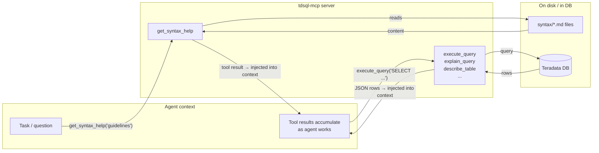
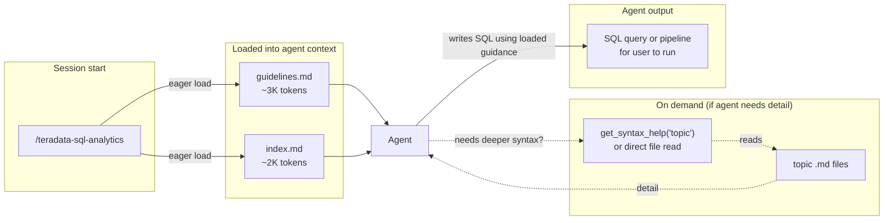
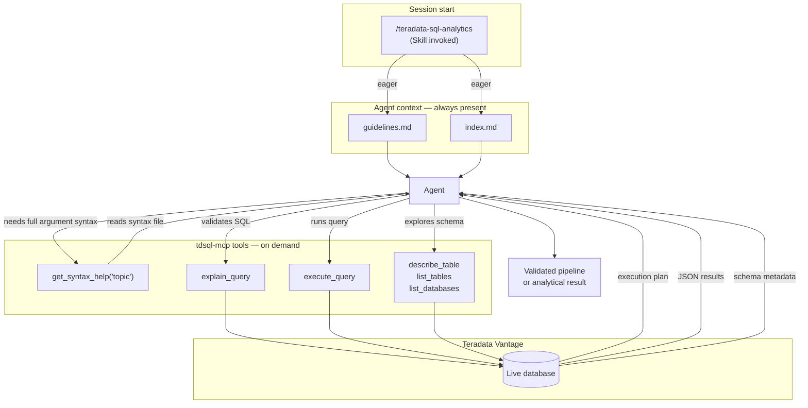

# How tdsql-mcp Works: Architecture Guide

This document explains how the MCP server and Skill work individually and together — and why the design makes agents significantly more effective at writing Teradata SQL.

---

## The Foundation: A Layered Syntax Library

Both the MCP server and the Skill draw from the same source: a structured library of Markdown files covering Teradata's native analytics functions. The library is organized in three layers that match how agents reason about analytics problems:

```
guidelines.md    ← "What native function covers this operation?"
                   Canonical mapping of 50+ common analytics operations
                   to native Teradata functions. Agents load this first.

index.md         ← Topic directory and workflow sequences.
                   Maps common use cases (fraud detection, clustering,
                   NLP, vector search, etc.) to ordered topic lists.

<topic>.md       ← Detailed syntax, arguments, output schemas, examples.
                   40+ files covering every domain. Loaded on demand.
```

**Key design principle: no topic file is loaded until it's needed.** Loading the full library upfront would consume enormous context tokens. Instead, agents load the canonical function map eagerly and pull detailed syntax only for the topics they actually use. Token cost scales with what the session needs, not with what exists.

---

## Three Modes of Operation

| | MCP Server Only | Skill Only | MCP + Skill |
|---|:---:|:---:|:---:|
| **Live SQL execution** | ✓ | — | ✓ |
| **Syntax reference** | On-demand | Eager + on-demand | Eager + on-demand |
| **Query validation (EXPLAIN)** | ✓ | — | ✓ |
| **Schema exploration** | ✓ | — | ✓ |
| **Teradata credentials required** | Yes | No | Yes |
| **Works with** | Any MCP client | Claude Code | Claude Code |
| **Best for** | Agents with DB access | SQL writing assistance | Full platform power |

---

## Mode 1 — MCP Server

The MCP server exposes SQL execution and the syntax library as tool calls over stdio or HTTP. The agent pulls content on demand — nothing is pre-loaded into context.



**How the agent uses it:**
1. Calls `get_syntax_help(topic="guidelines")` — learns what native functions exist and which one fits the task
2. Calls `get_syntax_help(topic="<relevant-topic>")` for detailed argument syntax
3. Calls `explain_query` to validate SQL before running it
4. Calls `execute_query` to run queries and iterate on results

**What makes this different from a plain database connector:** The agent isn't just running SQL — it's being guided toward native Teradata table operators at every step. Without the syntax library, agents default to hand-written SQL or Python logic. With it, they reach for `TD_XGBoost`, `AI_TextEmbeddings`, `TD_VectorDistance`, and the rest of the native stack.

---

## Mode 2 — Skill (No Server Required)

The Skill injects the guidelines and topic index directly into context at session start. No server, no credentials, no tool calls required for the reference content.



**How it works:**
1. User types `/teradata-sql-analytics` at the start of any Claude Code session
2. `guidelines.md` and `index.md` are immediately in context — no tool calls needed
3. The agent knows the full native function landscape from the first message
4. Deeper topic files are loaded lazily only if needed

**No DB execution.** The Skill is a knowledge library — the user runs the generated SQL in their own environment. This makes it useful even when you don't have credentials configured or just want SQL writing help.

---

## Mode 3 — MCP + Skill (Full Power)

The Skill and MCP server are complementary. The Skill handles **proactive guidance** (present from the first message). The MCP server handles **execution, validation, and deep reference**.



**Why this combination beats MCP alone:**

Without the Skill, the agent must *discover* the function library through tool calls — it only knows about `TD_XGBoost` if it happens to ask. With the Skill, the canonical function map is in context from the first message. The agent never reaches for hand-written SQL when a native operator exists, because it already knows what operators exist.

**The typical session flow:**
1. **Session start** — Skill loads guidelines + index. Agent immediately understands the native function landscape.
2. **Planning** — Agent identifies the right native functions for the task without needing tool calls.
3. **Deep reference** — Agent calls `get_syntax_help` for exact argument syntax on specific functions.
4. **Schema exploration** — Agent uses `describe_table` and `list_tables` to understand the data.
5. **Validation** — Agent uses `explain_query` to confirm SQL is syntactically correct before running.
6. **Execution** — Agent runs queries, iterates, and assembles the final pipeline.

---

## The Lazy Loading Pattern in Practice

A concrete example: a fraud detection session with MCP + Skill running.

| Step | What loads | Tokens added |
|------|-----------|-------------|
| `/teradata-sql-analytics` | guidelines.md + index.md | ~5K |
| Agent plans approach | Nothing — already in context | 0 |
| `get_syntax_help("data-prep")` | data-prep.md | ~8K |
| `get_syntax_help("ml-functions")` | ml-functions.md | ~10K |
| `get_syntax_help("model-evaluation")` | model-evaluation.md | ~6K |
| **Total** | 3 topic files out of 40+ | ~29K |

A vector search session would load `vector-search.md`, `embeddings.md`, and maybe `data-prep.md` — an entirely different subset. The 35+ remaining topics never touch the context window.

Compare this to a system that dumps the full reference at session start: every session would consume 150K+ tokens before the user types anything.

---

## Summary

The architecture is built around one insight: **agents perform better when they know what tools exist, not just how to use the tools they already know about**.

- `guidelines.md` solves the *discovery* problem — agents know the full native function landscape
- `index.md` solves the *navigation* problem — agents know what to load for each type of task
- Topic files solve the *syntax* problem — agents get exact argument references when they need them
- The MCP server solves the *execution* problem — queries run on the platform, not in the agent

The Skill and MCP server together create a complete loop: from "what should I use?" to "here's the syntax" to "let me validate it" to "here are the results."
